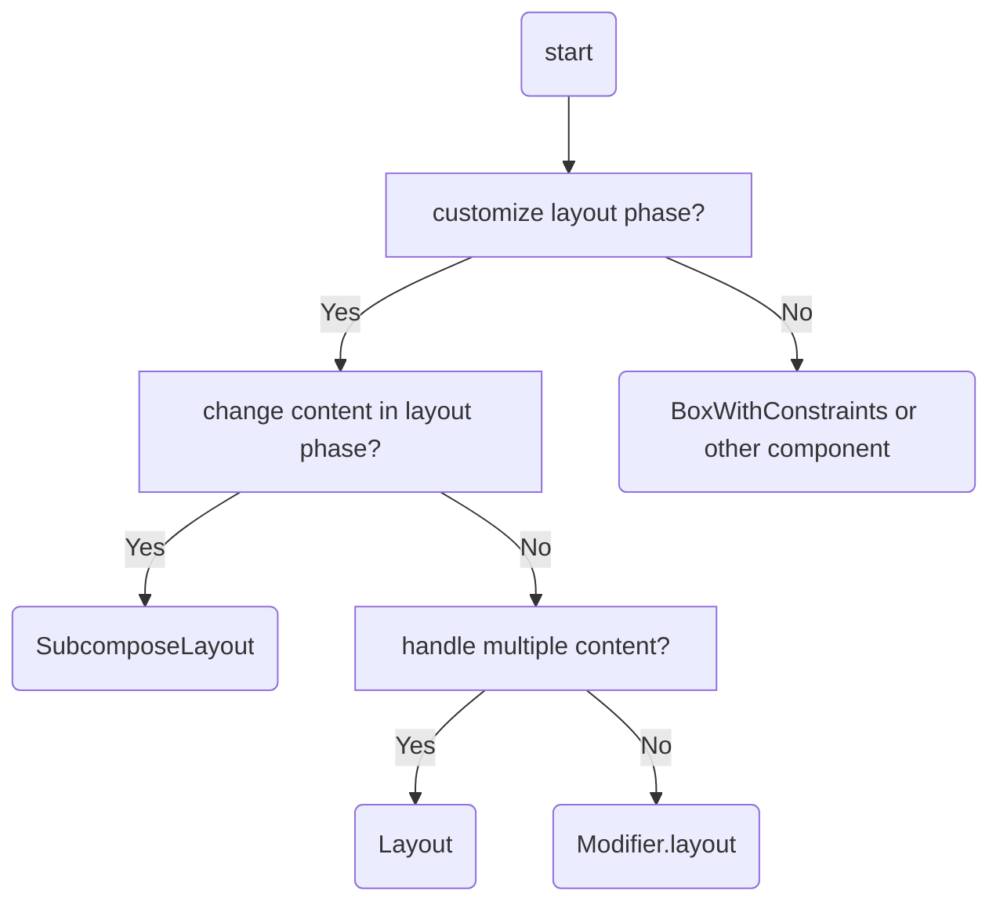

---
# You can also start simply with 'default'
theme: seriph
# random image from a curated Unsplash collection by Anthony
# like them? see https://unsplash.com/collections/94734566/slidev
# background: https://cover.sli.dev
# some information about your slides (markdown enabled)
title: Welcome to Slidev
colorSchema: dark
info: |
  ## Slidev Starter Template
  Presentation slides for developers.

  Learn more at [Sli.dev](https://sli.dev)
# apply unocss classes to the current slide
class: text-center
# https://sli.dev/custom/highlighters.html
highlighter: shiki
# https://sli.dev/guide/drawing
drawings:
  persist: false
# slide transition: https://sli.dev/guide/animations#slide-transitions
transition: slide-left
# enable MDC Syntax: https://sli.dev/guide/syntax#mdc-syntax
mdc: true
---

# 使って知るCustomLayout 
# vs DeilyScheduler


---
layout: two-cols-header
---


# 使って知るCustomLayout vs DeilyScheduler

::left::
## slide (github pages)

<br/>


<a href="https://sasasaiki.github.io/slidev_droidkaigi2024/1">sasasaiki.github.io/slidev_droidkaigi2024</a>

::right::

## code (github)

<br/>


<a href="https://github.com/sasasaiki/android_compose_daily_scheduler/blob/main/app/src/main/java/app/saiki/dailyscheduler/DailySchedule.kt">sasasaiki/android_compose_daily_scheduler</a>


<!--
それでは始めます、よろしくお願いします。
-->

---
layout: two-cols
---

# Self-introduction

　　
<br/>

Name


### saiki iijima

At
<br/>


X
### @saikiiiji


::right::


<!--
まずは自己紹介をさせていただきます。

改めまして、飯島 彩輝と申します。
現在は株式会社UNEXTにてUnextという動画配信サービスのAndroid端末やFireTablet向けのAndroidアプリの開発をしております。

社内外問わず、このご飯のアイコンで活動していますので今日はぜひこのアイコンだけでも覚えて帰っていただければと思います。
手作りです。

-->


---
layout: two-cols-header
---

# Droidkaigi

<br/>

### Second time in 6 years.


::left::

## Droidkaigi2019

<br/>


https://www.youtube.com/watch?v=1eK_RBdqFMo

::right::

## Droidkaigi2021

<br/>


https://ninjas.droidkaigi.jp/post/recruit/

<!--

Droidkaigiに関連した話だと、2019年にTDDに関する発表をさせていただいて、2021年にはDroidKaigi Ninjaずに記事を投稿させていただいたりしておりまして、スピーカーとしては6年ぶり2度目の参加となります。

-->

---
layout: default
---

# U-NEXT

<ul style="display:flex;">


</ul>

<!-->
関わっているサービス、Unextについても少しだけ紹介させてください。
Unextは動画配信のサービスとなっておりまして、AndroidやiOS、webなど、様々な端末からご利用いただけます。

-->

---
layout: default
---

# U-NEXT


https://www.unext.co.jp/ja/press-room/bmw-2024-06-20


<br/>
<br/>


https://www.video.unext.jp/lp/football_pack

<!-->
最近のニュースとしては、MBWのカーナビから利用できるようになったり、サッカーのプレミアリーグ全試合の独占配信が始まったりと、私がいうのもなんですが、非常にあついサービスとなっておりますので
ぜひ一度試しに使ってみていただければと思います。BMWを買っていたダクカ、お手元の端末でも試せますのでよろしくお願いいたします。

<-->

---
layout: default
---

# Table of Contents

- Learnig Custom layout
    - What's CustomLayout?
    - Which method?

- Practice Custom layout
    - vs Daily Scheduler


<!--
本日のお品書きです。
今日は、使って知るCustomLayou vs DailyScheulerということで、
序盤はCostomLayoutってなんだっけっていうのを軽く確認して、

後半では、vs DailyScheduerということで、DailyScheduerの作成を通してCustomLayoutへの理解をより深めます。
-->

---
layout: two-cols
---

# Daily Scheduler

## with Layout()

<br/>

- Show time label 
- Show Vertical axis
- Show event
- Adjusting width for overlapping events
- Drag and drop
- Snapping events
- Lazy rendering  


::right::

<br/>
<br/>

<video autoplay muted loop style="height:400px; margin:0 auto;">
  <source src="/first.mov" type="video/mp4" >
</video>

<!-->

DailyScheduerというのはその日の予定が表示されて、スクロールができて、イベントをドラッグ＆ドロップで移動できるようなカレンダーアプリに使われそうなこのビューのことを今回は指しています。

Layout関数を使って、0から作っていきます。詳細は後半に再度説明します。

一息

-->

---
layout: section
---

## Today's Goal
# I can create a custom layout! 

<!--

本日のゴールは、Layout関数を使って簡単なCustomLayoutを作れるようになることです。

一息

-->


---
layout: section
---

# What's Custom layout?
https://developer.android.com/develop/ui/compose/layouts/custom?hl=ja

<!--

では早速、CostomLayoutとは何かという話からしていきましょう。

Custom layoutについてはAndroidDevelopersにCustomLayoutというタイトルのページがあるのですが、定義が明文化はされていなかったため、
今日の発表では、このページを参考に、

-->


---
layout: section
---

# Compose has 3 phases

<br/>


https://developer.android.com/develop/ui/compose/phases


<!-->

Compsoeの3つのフェーズ

coposition,layout,draw、のうちの二番目のLayoutフェーズを独自で実装したComposableのことをCustomLayoutと呼ぼうと思います。

Jetpack Composeが提供する標準のレイアウトコンポーネント Column、Row、Boxなどでは実現できない挙動を実装する際に作成することが多いです。

-->


---
layout: section
---

# Which method should I choose?

<!-->
さて、複雑なUIを実現するために、カスタムレイアウトを作りたい。
と思った時に取れる方法には、いくつか選択肢があります。
第一歩として、どの方法を選ぶのが良いのか、というところから確認していきましょう。
-->

---
layout: default
---

# Which method should I choose?

- Layout()
- modifier.layout()
- SubcmposeLayout()
- BoxWithConstraints()


<!--
選択肢としては、

Layout
modifier.layout
subcmposeLayout
BoxWithConstraints

ここら辺が上がってきます。

BoxWithConstraintsは今回の定義からは外れているのですが、近いものがあるので合わせて見ていきます。

それぞれ何ができるかと、何に使うかを見ていきます。
結構駆け足で紹介するので、詳細はさておき、どれをどう選べばいいかだけをおさえていただければと思います。

-->

---
layout: section
---

# Layout()


<!-->

まずはレイアウト関数です。

その名の通り、Layoutフェーズを独自に実装するためのComposable関数です。

-->

---
layout: default
---

# Layout()

```kt {*|1-6|8-13}
Layout(
    content = {
        Text("1")
        Text("2")
        Text("3")
    },
    modifier = Modifier
) { measurables, constraints ->
        ..
    layout(100, 100) {
        ..
    }
}

```

<!-->
使い方としてはこのように→
contentにComposableを渡して、→最後のブロック内で渡したそれぞれのコンテンツについてLayoutを行います。
-->

---
layout: default
---

# Layout

<br/>

## Can

<br/>
<v-clicks>

- Layout elements
- Handle multiple child elements
- Reference parent constraints
- Reference the size of other elements
</v-clicks>


## Use case

<br/>

<v-click>

### Customize the <b class="safe">position and size</b> of <b class="warn">mulitiple elements</b> during the layout phase.

</v-click>


<!-->
できることと用途を確認します。
Layout関数では、要素をレイアウトすることが可能です。->
また、複数の子要素を個別にレイアウトすることができます。->
親の制約を参照できます。 ->
他の要素のサイズも参照できます。
なので、複数の要素を渡し、親の制約や、他の要素のサイズを条件に、それぞれの要素のサイズや配置を確定することができます。

ただし、配置するContentそのものを変更することはできません。

例えば一つ目の要素の幅が100以上かどうかで残りの要素を、テキストにするか、Spacerにするかを動的に変える、ということはできません。

→レイアウトフェーズで複数の要素の位置とサイズをカスタマイズしたい場合に利用できます
-->


---
layout: section
---

# modifier.layout()

<!-->

次がmodifier.Layout()です。

先ほどのLayout関数と近い使い方ができるのですが、こちらはモディファイアの関数として定義されています。

-->


---
layout: default
---

# modifier.layout()

```kt {*|4|4-6|*}
Column(
        horizontalAlignment = androidx.compose.ui.Alignment.End,
        modifier = modifier
            .layout { measurable, constraints ->
                // do something
            }
    ) {
        Text(
            text = "test1",
        )
        Text(
            text = "text2",
        )
    }
``` 
<!-->
使い方としては、このように->modifer.で呼び出して使います。
この場合はColmunに付与しています。->

そしてこのbloackの中でColmunに渡されているコンテンツに対してLayout処理ができます。
ただし、Layoutのタイミングではcontentをまとめて一つにした要素しか入ってこないので、
ー＞
text1とtext2を両方同じようにずらすといった使い方はできますが、それぞれを別の方向にずらすというような別々の処理はここではできません。

（一息）

-->


---
layout: default
---

# modifier.layout()

<br/>

## Can<br/>
<v-clicks>

- Layout elements
- Handle a single element
- Reference parent constraints

</v-clicks>

<br/>

## Use case

<br/>

<v-clicks>

### Customize the <b class="safe">position and size</b> of a <b class="warn">single element</b> during the layout phase.

</v-clicks>


<!--
できることと用途を確認します。
Modifier.layoutは->
要素をレイアウトすることが可能です。->
ただ一つの要素だけをlayoutすることができます。→
そして、親の制約を参照することができます。→

→レイアウトフェーズで単一の要素の位置とサイズをカスタマイズしたい場合に利用できます
-->


---
layout: section
---

# SubcomposeLayout


<!-->
次に、SubcomposeLayoutです。

こちらはLayoutと比べてより複雑な実装が可能です。
<-->


---
layout: default
---

# SubcomposeLayout

```kt {*|2-4}
SubcomposeLayout { constraints ->
    // It's a special one!
    val childPlaceables = Subcompose(Slots.Children, children)
        .map { it.measure(constraints) }
    
    layout(layoutWidth, layoutHeight) {
        // layout
    }
}
```

<!-->

すごく軽い説明しかしないのですが、使い方としては、Layout関数でも必要な処理に加えて、->
このSubcomposeというメソッドで、coposableのcompositionを行いmesurableを作成することができます。

<-->


---
layout: default
---

# SubcomposeLayout

## Can

<br/>

<v-click>

- Layout elements
- Handle multiple child elements
- Reference parent constraints
- Reference the size of other elements

</v-click>


<v-click>

- **Dynamically switch content during the layout phase**

</v-click>


## Use case

<br/>


<v-click>

### Customize the <b class="safe">position and size</b> of multiple elements during the layout phase and <b class="warn">change the elements</b> themselves.

</v-click>


<!--
できることと用途を確認します。
SubComopseLayoutは、Layout関数にできたことは→全てできます。

そこに追加で、先ほどLayoutでできないといっていた、→ LayoutフェーズでContentそのものを変更することが可能になります。

→親の制約、他の要素のサイズ、位置を見ながら、それぞれの要素のサイズと位置、さらに、何を配置するかまで決めることができるのでLayout関数に加えて何を配置するかまで変えたい場合にはSubCopmoseLayoutを使う必要があります。

-->


---
layout: section
---

# BoxWithConstraints

<!-->
最後に

BoxWithConstraints

です。

BoxWithConstraintsは、親の制約を参照できるボックスです。

-->


---
layout: default
---

# BoxWithConstraints


``` kt
BoxWithConstraints {
     if (maxWidth < 600.dp) {
         Column {
             Text("small screen")
             Text("small screen")
         }
     } else {
         Row {
             Text("Large screen")
             Text("Large screen")
         }
     }
 }

```

<!--
例えば、これは親のmaxWidthが600ドットdpより大きいか小さいかで、表示するComposableを絡むか、ろうにだし分けています。

他の方法だった場合親の制約から取れる値はピクセルなのですがboxWithconstraintの場合はdpに変換された状態で取れるのでとてもお手軽です。
-->

---
layout: default
---

# BoxWithConstraints

<br/>

## Can

<br/>


<v-click>

- Reference parent constraints
- Switch content

</v-click>


## Use case

<br/>
<v-click>

### Change the layout elements <b class="warn">based on the parent’s constraints</b>
</v-click>


<!-->
できることと用途を確認します。
BoxWithConstraintsは、親の制約を参照できます。
そして、->中のComposableを変更することができます。

逆に、それ以外はできないので、サイズや、配置は、通常のBoxの挙動に任せることになります。

→親の制約によって、中のComposableを変えたい場合に利用できます。
（めくって一息つく）
-->

---
layout: default
---

# Which method should I choose?

- Layout()
    - Freely position&size multiple elements.
- modifier.layout()
    - Freely position&size a single element.
- SubcomposeLayout
    - Choose and freely position&size elements.
- BoxWithConstraints
    - Select elements based on the parent’s constraints.

<!--
ここまでで、それぞれができることと用途を確認できました。まとめるとこのようになります。

が、これだけだとまだいまいち選び方がわからないなあということで、
-->


---
layout: center
---

# Which method should I choose?




<!-->
とても、便利な、フローチャートを作ってきました。

菱形だと場所をとるので全てしかくになっているのですが、カスタムレイアウトを作りたいな、と思った時にはこの図に従えば適当なメソッドが選べると思います。

-->

---
layout: two-cols-header
---

# Which method should I choose?

::left::


::right::

<br/>


<!-->
ということで、今回作るDailySchedulerで試してみましょう。

まずはLayoutPhaseをカスタマイズする必要があるか、を考えます。
既存のComposableでできないか、というところですね。

今回の場合は、空間があったり、幅や高さを調整したりする必要があり、普通のCompossableで実現するのは難しそうなのでyes,で左に行きます。

次に、LayoutPhaseで配置するcontentそのものを変更する必要があるかを考えます。

今回、カレンダーのイベントは全て同じこの四角いComposableで表現して、位置とサイズのみの調整で済ませます。

なのでここはno、で右に行きます。

最後に、複数のコンテンツを扱うかです。

今回は、ラベルもイベントも複数あり、それぞれの位置と高さを調整する必要があります。

なので、yesに行きLayout関数にたどり着きました。
このDailySchedulerはLayout関数で作成すると良さそうです。

-->


---
layout: section
---

## Practice Custom layout

# vs Daily Scheduler

<!-->

では、Layout()で作れば良い、というのがわかったところで実際に作りながら、Layout関数の使い方をおさえていきたいと思います。

-->

---
layout: two-cols
---

# Daily Scheduler

## with Layout()

<br/>

<v-clicks>

- Show time label 
- Show Vertical axis
- Show event
- Adjusting width for overlapping events
- Drag and drop
- Snapping events
- Lazy rendering  

</v-clicks>

::right::

<br/>
<br/>

<video autoplay muted loop style="height:400px; margin:0 auto;">
  <source src="/first.mov" type="video/mp4" >
</video>

<!-->

もう一度作るものの確認をしておきましょう

今右側に見えている、1日のスケジュールを表示するUIを作っていきます。

実装する機能としては→
TimeLabel、左側にある時刻のラベルです→

横線　ラベルの上にある横線ですー＞

イベントを表示します→
時間が重なっているイベントが完全に重なってしまわないように幅を調整します→
イベントをドラッグ&ドロップで移動できるようにし→
その際にきりのいい時刻、今回は15分刻みで移動されるようにし→
大量にイベントがあった場合にも滑らかにスクロールできるように工夫をしていきますl

このうちのShowEventくらいまでが、Layout関数の主な説明となりまして、そこより後ろは、Layout関数自体の説明はほぼないので、参考実装といった気持ちで見ていただければと思います。

では、やっていきましょう、まずはTmeLabelの配置です

-->

---
layout: default
---

# Place time label


<!-->
実はこのTimeLabelの配置だけでLayoutの説明がほぼほぼ入っているので、やることは単純な割に結構長くなります。

まず要素と並びを確認します。

タイムラベルがあって、一時間分の間隔でまたタイムラベルががある、それを必要なだけ繰り返します。

今回タイムラベルの高さは適当に定義した固定の値を使います。
つまり、高さが固定の絡むなので、すごくシンプルです。

では、実際のコードを考えていきます。
-->


---
layout: default
---

# Create DailyScheduler

```kotlin {*|1-4|8-11|5-9|11-14}
@Composable
fun DailyScheduler(
  timeLabel: @Composable (LocalDateTime) -> Unit,
){
  // Create contents
  val timeLabels = TODO()
  // Add contents
  Layout( // Parent
    content = timeLabels, // Children
    modifier = Modifier,
  ){ measureables, constraints ->
        // Layout contents
        layout(...
    }
}
```

<!--
まずは基本部分からです。->

これから作るLayoutのfunをComposableで定義します。
TimeLabelを外からカスタマイズできるように引数でComposableを受け取るようにしています。->

ここがLayoutの定義です。

今回の発表ないでは、Layout関数自体を親、contentに追加したComposableたちを子要素と呼びます。

引数にはcontentとmodifierとmeasurePolicyを受け取ります。メジャーポリシーは末尾にラムダで書く事ができます。

Layoutを作るステップとしては ->
contentを作ってLayoutにわたし、measurePolicyのblock内でレイアウトを行う。基本的にはこれだけ何ですが、

-->

---
layout: 
---

# 3 step in layout phase 


https://developer.android.com/develop/ui/compose/layouts/custom


<!--
レイアウトの中でもコヨウソを測定して、親のサイズを決めてコヨウソを配置するという三つの手順を踏む必要がありますので、こちらも順に見ていきます。
-->

---
layout: 
---

# Add Content 

```kt {*|1-6|8-12}
// create contents
val timeLabels = @Composable {
  repeat(24) { i ->
      timeLabel(LocalDateTime.of(now.year, now.month, now.dayOfMonth, i, 0))
  }
}

// add content
Layout(
        content = sideBarTimeLabels,
        modifier = Modifier
    ){ ..

```

<!-->
ではまずはLayoutに渡すcontent、コヨウソの作成です。->
今回は一日分なので24回repeatして、渡されてきたtimeLabel関数にDateTimeを渡して呼び出しています。
TimeLabelのComponentの中でDateTimeが呼べるので好きに表示することができます。 ->

そしてこれをcontetntとして渡してあげます。
step1のcontentの追加は完了です。

追加されたcontentはMeeasurePolicyのブロックの中で処理することができます。

layoutに入っていく前にラムダに何が渡されてくるのかを確認しましょう

-->

---
layout: default 
---

# MeasurePolicy?

```kt 

fun interface MeasurePolicy {

    fun MeasureScope.measure(
        measurables: List<Measurable>,
        constraints: Constraints
    ): MeasureResult

.... some functions...

```

<!--

ラムダの部分ではMeasurePolicyのmeasure関数に処理を書いていることになり、ここにはmeasurablesとconstraintsという値が渡されてきます。

-->

---
layout: default 
---

# Measurable

```kt

/**
 * A part of the composition that can be measured. This represents a layout.
 * The instance should never be stored.
 */
interface Measurable : IntrinsicMeasurable {
    /**
     * Measures the layout with [constraints], returning a [Placeable] layout that has its new
     * size. A [Measurable] can only be measured once inside a layout pass.
     */
    fun measure(constraints: Constraints): Placeable
}

```

<!--
measureblesはMeasurableのリストです。
Measurableは、measure関数が定義されたinterfaceで、これを使って子要素のサイズを測定することが可能です。

-->
---
layout: default
---

# Mesurables

```kt

// create contents
val timeLabels = @Composable {
  repeat(24) { i ->
      timeLabel(LocalDateTime.of(now.year, now.month, now.dayOfMonth, i, 0)) // In the list.
  }
}

```

<!--

先ほどわたしたcontentは大元は一つのこのようなCoposableなラムダだったんですが、
このmeasure関数にはtimeLabelひとつひとつに対応したMesurableがListになって入ってきます。

-->

---
layout: section
---

# Constraints

<!-->
次にconstraintsです。

-->


---
layout: default
---
# Constraints

```kt
val minWidth: Int
val maxWidth: Int
val minHeight: Int
val maxHeight: Int
.. and more

```

<!-->

コンストレインつは、

minWidth, minHeight, maxWidth,  maxHeigh など、サイズの制約に関する情報を持っています。

-->


---
layout: default
---
# Constraints

```kt
  Layout( // Parent
    ..
    measurePolicy = { measureables, constraints ->
        // This constraints is **parent's** constraints
    }
  )

```

<!-->

ここでは親に与えられた制約が入ってきます。
具体的に少し確認してみます。

-->


---
layout: default
---
# Constraints

```kt
// MainActivity.kt
Scaffold(
    modifier = Modifier
        .fillMaxSize()
    ) { innerPadding ->
        DailyScheduler(..)
    }
```

<!-->

FillMaxSizeのScaffoldにDailySchedulerを置いているとして。

親のmodifierに幾つか制約をつけてconstraintsをprintしてみます。

-->


---
layout: default
---

# watch the constraints 

```kt {*|1-2|4-5|7-8|10-12}
// none
Constraints(minWidth = 0, maxWidth = 1080, minHeight = 0, maxHeight = 2400)

// .fillMaxHeight()
Constraints(minWidth = 0, maxWidth = 1080, minHeight = 2400, maxHeight = 2400)

// .verticalScroll(state = rememberScrollState()),
Constraints(minWidth = 0, maxWidth = 1080, minHeight = 0, maxHeight = Infinity)

// .fillMaxHeight()
// .verticalScroll(state = rememberScrollState()),
Constraints(minWidth = 0, maxWidth = 1080, minHeight = 2400, maxHeight = Infinity)

```

<!--

幅はさわっていないので、ハイトに注目してみましょう。→
何もなかった場合は、minが0,maxが表示領域の高さになり、->

fillMaxHeightを指定した場合にはminHeightとmaxHeightが表示領域の高さになります。->

verticalScrollを入れてみるとmaxHeightがInfinityになり->
両方入れるとminが表示領域の高さ、maxがinfinityになります。

子要素のmeasureでは、この親の制約をそのまま使うか、copyして一部上書きして使うか、新しい制約を使うことになります。

-->


---
layout: default
---
# Copy 

```kt {1-4|6-9|11-16}
 
val placeable = measurable.measure(constraints.copy(
    minHeight = 0,
    maxHeight = constraints.maxHeight,
))

val placeable = measurable.measure(constraints.copy(
    minHeight = 100,
    maxHeight = 100,
))

val placeable = measurable.measure(constraints.copy(
    minHeight = constraints.maxHeight,
    maxHeight = constraints.maxHeight,
))
```

<!-->
例えば、親のサイズないでcomposable自体のサイズに任せてサイズを決める場合はminが0,maxはそのままmaxHeight
->サイズを固定したい場合には、両方に固定の値を入れたり、
->とにかく最大まで伸ばしたい場合には両方にmaxを入れるなどといった使い方ができます。

-->

---
layout: default
---
# Fixed size 

```kt
 
Constraints.fixed(width,height)

Constraints.fixedWidth(width)

Constraints.fixedHeight(height)

```

<!-->
また、固定のサイズにしたい場合にはConstraintsにfixed系のメソッドが生えているのでそれらを利用することも可能です。
-->

---
layout: default
---
# Be careful about crashes 

```kt {*|1-7|9-15}
// minHeigh > maxHeight
val placeable = measurable.measure(constraints.copy(
    minHeight = 100,
    maxHeight = 90,
))
// error message : 
// java.lang.IllegalArgumentException: maxHeight(90) must be >= minHeight(100)

// When constraints.maxHeight == infinity
val placeable = measurable.measure(constraints.copy(
    minHeight = constraints.maxHeight, 
    maxHeight = constraints.maxHeight,
))
// error message :
// java.lang.IllegalArgumentException: Can't represent a size of 2147483647 in Constraint 

```

<!-->
ここで注意点がありまして、使い方によってはクラッシュするケースがあります。
→
まずはminの方がmaxより大きくなってしまった場合にはクラッシュします。
→

そして、minとmaxにInfinityが入ってしまった場合にもクラッシュします。

こういうmeasureをしていて、親にverticalScrollがついている場合などです。

つまり、minにInfinityが入る場合はクラッシュするので、minの方にconstraintsのmaxを入れる場合には特に注意する必要があります。->

-->


---
layout: section
---
## You can use 
# constraints.hasBoundedHeight() 

## to check if minHeight is infinity

## ( also width ) 

<!-->

具体的には、constraintsにmaxがinfinityかどうかをチェックするhasBounded何たらというメソッドが生えているので、それを使って、処理を分岐させることができます

-->

---
layout: default
---
# If maxHeight is infinity 

```kt {1,3-6|2|*}
// When constraints.maxHeight == infinity
// measurable　== Text(Modifier = modifier.fillMaxHeight())
val placeable = measurable.measure(constraints.copy(
    minHeight = 0, 
    maxHeight = constraints.maxHeight,
))

// placeable.height is text height.

```

<!-->

これはおまけなんですが、感覚的にはmaxHeightにinfinityが入っていて -> コヨウソのcomposableにMaxHeightがついていた時に高さがInfinityになってクラッシュするかと思ったんですが、->
確認して見たところ、クラッシュはせずTextの場合はwrapContentと同じような挙動になりました。
fillMaxをつけているのに最大サイズにならないときは親の制約を気にしてみると良いかもしれません。

（ここで一息つく）

では、実際にconstraintsを利用して子要素の測定をしていきます。

-->

---
layout: default
---

# Prepare

```kt
    val density = LocalDensity.current
    val minuteHeightDp = 2.dp
    val minuteHeightPx = with(density) {
        minuteHeightDp.roundToPx()
    }
    val hourHeightPx = minuteHeightPx * 60
```

```kt

    Layout(
        content = sideBarTimeLabels,
        modifier = Modifier
            .fillMaxHeight()
            .verticalScroll(state = rememberScrollState()),
...

```
<!-->

事前準備として、一分あたりの高さを2dpとして、そのPxと60をかけた一時間あたりの高さを定義しておきます。
LayoutPhaseで扱われる数字は基本的にdpではなくpixelです。

縦方向にスクロールしたいため親のModifierにfillMaxSizeとverticalScrollをつけておきます。

これで準備ができたのでレイアウトをしていきます。

-->


---
layout: default
---

# Layout phase

1. Measure children: A node measures its children if any exist.
2. Decide own size: Based on these measurements, a node decides on its own size.
3. Place children: Each child node is placed relative to a node's own position.


> https://developer.android.com/develop/ui/compose/phases#layout

<!-->

このレイアウトではLayoutPhaseの3Stepの通りに

コヨウソを測定して、親のサイズを決めて、コヨウソの配置をする必要があります。

まずはコヨウソを測定していきます。

-->


---
layout: default
---

# Let's measure

``` kt
{ timeLabelMeasureables, constraints ->
      val timeLabelPlacables: List<Placeable> = timeLabelMeasureables.map { measurable ->
          measurable.measure(
               constraints.copy(
                  minHeight = 0,
                  maxHeight = hourHeightPx
              )
          )
       }
```

<!--

具体的には、MesurableのListを回して、それぞれの要素で.measureを読んでplaceableを作成します。

先ほど親にはFillMasHeightとVerticalScrollをつけたので、
そのまま使うと、ラベルは全て表示領域いっぱいのの高さになるので、0と一時間あたりの高さを指定してやります。

こうすると、一時間分の領域内で、labelのcomponentのサイズが決まります。

これだけで測定は終わりです。

今回のラベルはTextをただ置いただけなので、テキストのサイズになります。

もし、ラベルにFillMaxHeightをつけていた場合は、一時間分の高さまでは伸びることになります。

measureの結果はPlaceableというクラスで返ってきます。このPlaceeableから測定した結果の高さや幅を取得することが可能です。

// ちなみにmeasuredHeighというものも生えていて、heightは最終的に表現されるサイズ、mesuredHeightは測定されたサイズで、基本的には一致しているが、場合によっては一致しないらしいので注意が必要です。

// いろいろ試したんですが、一致しないケースを再現できなかったので、再現方法がわかる方いたらぜひ教えてください。
-->

---
layout: default
---

# Let's layout

```kt
// interface MeasureScope { ...

fun layout(
        width: Int,
        height: Int,
        alignmentLines: Map<AlignmentLine, Int> = emptyMap(),
        placementBlock: Placeable.PlacementScope.() -> Unit
    ): MeasureResult

```

<!--

次に親のサイズを決め、コヨウソを配置します

ここでは小文字の方のlayout関数を使います

この関数はwidth height alimentLines placeMentBlockを受け取ります。

widthとheightで親のサイズを確定し、placementBlockで小要素を配置します。

-->


---
layout: section
---

# alignmentLines
https://developer.android.com/develop/ui/compose/layouts/alignment-lines?hl=ja

<!--

alignmentLinesは今回使わないのですごく軽く説明するのですが、これを使うことで、親の直接的な親および間接的な親のLayoutフェーズに任意のIntを渡すことが可能です。

例えばTextのFirstBaselineなんかがこの仕組みを利用しています。

詳しくは公式のページをご覧ください。いざというときに役に立つのではないかと思います。

（ここで一息）

ではlayout関数を使って配置をしていきましょう

-->


---
layout: default
---

# Let's layout

```kt {*|3-4,6|1,3,5,6|7-13}
val totalHeight = hourHeightPx * timeLabelMeasureables.size

layout(
    width = constraints.maxWidth,
    height = totalHeight
) {
  timeLabelPlacables.forEachIndexed { index, placeable ->
      placeable.place(
        x = 0,
        y = hourHeightPx * index,
        zIndex = 0f // 0f is specified by default, so there is no need to specify it.
      )
  }
}

```


<!--
まずは親のWidhtyとはいとを設定します。->
幅はできる限りいっぱいに広がってほしいため、ConstraintsのmaxWidthを使って指定します。
->高さは表示する時間全てを置けるだけ必要なので、ラベルの数に一時間あたりの高さをかけたものになります。
ここにMaxHeightを入れるとinfinityが入ってしまい、IllegalStateExceptionでcrashするのでご注意ください。


->
blockの中ではこ要素を配置します。
やることは先ほどmesureすることで作られたPlaceableのplaceを呼び出すだけです。
xとyとzindexが指定できます。

Composeの世界では0,0が左上なので右に動かしたければxに、下に動かしたければyに+の値を入れます。

zIndexは描画の順で、大きい値を指定するほど手前に描画されます。

今回は横にはずらさずに下に順に置いていきたいので、一時間あたりの高さにindexをかけたものをyに入れています。

これでタイムラベルの実装は終わりです。

-->


---
layout: default
---

# Label

<div style=" display: flex; justify-content: center;">


</div>

<!--

左がlabelにmodifierを指定していない場合、右がFillMaxHeightとpaddingを指定してみた場合です。
想定通り、1時間の範囲でサイズが決まっているのがわかります。

-->

---
layout: default
---

# Vertical axis display according to time


<!--

では次、に横線の表示です。

特に難しいことはないです。

-->

---
layout: default
---

# Add to contents

```kt
    val backGroundLines = @Composable {
        repeat(timeLabelCount) { i ->
            Box(
                modifier = Modifier
                    .fillMaxWidth()
                    .height(1.dp)
                    .background(MaterialTheme.colorScheme.onSurface.copy(alpha = 0.2f))
            )
        }
    }

```
<!-->

とりあえず、ラベルと同じようにLayoutに渡すcomopsesableを定義します。
ラベルと同じ個数の、横幅いっぱいで高さ1dpの色つきBoxにしてみます。

<-->

---
layout: default
---

# Add to contents

```kt {*}
Layout(
    /*  
    content = {
        sideBarTimeLabels()
        backGroundLines()
    }
    */
    contents = listOf(
        sideBarTimeLabels,
        backGroundLines
    ),
    ..
```

<!--

そしてレイアウトに渡します。

ここでワンポイントなんですが、Layout関数にはContentとしてComposableを受け取るものとContentsとしてcomposableのListを受け取るものとがあります。

contentの方だと、measureBlockに入ってくるmesurablesがラベルとラインの区別なく全て一つのリストとして入ってくることになるため、属性の違うcomposableを扱う場合はListで渡す方が使いやすいです。

-->


---
layout: default
---


# Add to contents

```kt
    { (timeLabelMeasureables, backGroundLinesMeasureables), constraints ->
    // measure and layout...
    ...
```

<!--
使う時はこのように括弧で囲むとそれぞれに代入できるので、あとは先ほどと同じように

-->

---
layout: default
---


# measure line

```kt
val linePlaceables = backGroundLinesMeasureables.map {
    it.measure(
        constraints.copy(
            minHeight = 0,
            maxHeight = hourHeightPx
        )
    )
}

```

<!-->

measureして

<-->

---
layout: default
---


# Layout line

```kt
layout(constraints.maxWidth, totalHeight) {
    timeLabelPlacables.forEachIndexed { index, placeable ->
        val y = hourHeightPx * index
        placeable.place(
            x = 0,
            y = y,
        )
                    
        linePlaceables[index].place(
            x = 0,
            y = y,
        )
    }
}

```


<!-->

配置すれば完成です。
TimeLabelと同じだけ作っているので、雑にタイムラベルと同じ位置にplaceしています。

<-->


---
layout: default
---

# Complete 


<!-->

（ここで一息）

<-->

---
layout: default
---

# Put Event


<!--
さて、次はイベントを置いていきます。

まずはイベントのデータを定義します。

-->

---
layout: default
---

# Event Data

```kt

data class CalendarEvent(
    val id: String,
    val title: String,
    val startTime: LocalDateTime,
    val endTime: LocalDateTime
)

```

<!--
表示に必要な最低限の情報としては
start
end
のタイムがあれば良いですが、一応idとtitleだけ入れています。
-->

---
layout: default
---

# Add event

```kt

@Composable
fun DailyScheduler(
    modifier: Modifier = Modifier,
    events: List<CalendarEvent>, // add
    timeLabel: @Composable (LocalDateTime) -> Unit = { StandardTimeLabel(time = it) },
    eventContent: @Composable (CalendarEvent) -> Unit = { EventItem(event = it) }, // add
) { ...


```

<!--

次にカスタムレイアウトの引数に、表示するeventのリストとconposableを追加します

-->

---
layout: default
---

# Create eventContents

```kt {1-8|9-20}
val eventContents = @Composable {
    events.sortedBy { it.startTime }.forEach {
        Box(modifier = Modifier.calenderEventModifier(it)){
            eventContent(it)
        }
    }
}
..
Layout(
    contents = listOf(
        sideBarTimeLabels,
        backGroundLines,
        eventContents // add
    ),
    ..
    { (timeLabelMeasureables, backGroundLinesMeasureables, eventMeasureables /* add */) .. ->

```

<!--
イベントのリストから、ebentのcomposeを同じだけ作って→渡します。

これでLayoutの中でstartとendを見て配置すればいいのですが、一つ問題があります。
ブロックに入ってきたmesurabelはeventの情報を持っていないので、今のままだとstartとendを参照することができません。
-->

---
layout: section
---

# ParentDataModifier

<!-->
そこで
- ParentDataModifier
というものを使います。

これを利用することで、任意のdataを親に伝えることが可能です。

使い方は結構簡単で
-->
---
layout: default
---

# ParentDataModifier

```kt {1-5|9-16}
fun Modifier.calenderEventModifier(event: CalendarEvent) = this.then(
    object : ParentDataModifier {
        override fun Density.modifyParentData(parentData: Any?): Any = event
    }
)

----------

    val eventContents = @Composable {
        events.sortedBy { it.startTime }.forEach {
            Box(modifier = Modifier.calenderEventModifier(it)){ // here
                eventContent(it)
            }
        }
    }

```

<!--
このように、Modifierの拡張カンスうして定義します。
拡張関数では親に渡したいで－たを受け取り、
中ではParentDataModifierを継承したオブジェクトを作成し、modifParentDataに受け取ったデータをセットします。

→あとは、使いたい要素、今回だとeventのmodifierに追加して親から参照したいデータを渡します。

eventContentは中がどういう構造になっているかがわからないので、直接modifierを追加せずにBoxで囲んで追加するのが安全です。
-->

---
layout: default
---

# Get parent data

<br>
<br>
<br>

```kt

    val eventPlaceablesWithEvent = eventMeasureables.map { measurable ->
        val event = measurable.parentData as CalendarEvent

```


<!--

こうすると、layoutの中で、mesurable.parentDataとしてCalendarEventを参照することができます。

問題が解決できたので次に進みましょう。

-->

---
layout: default
---

# Layout event

```kt {*|2|3-4|3-5|6|7-14}
val eventPlaceablesWithEvent = eventMeasureables.map { measurable ->
    val event = measurable.parentData as CalendarEvent
    val eventDurationMinutes =
        ChronoUnit.MINUTES.between(event.startTime, event.endTime)
    val eventHeight = (eventDurationMinutes * minuteHeightPx).toInt()
    val eventWidth = constraints.maxWidth - labelMaxWidth                
    measurable.measure(
        Constraints.fixed(
            width = eventWidth,
            height = eventHeight
        )
    ) to event
}

```


<!-->

まずは、先ほどの通りeventをparentDataから取ります。->
そしてeventが何分なのかをstartとendから求めます。->
一分あたりの高さをかけて高さを求めます。->
幅はlabelと重ならないように、一番幅のあるラベル分だけ引いておきます。->

そしてEventは幅も高さも固定のサイズなので、Fixedを使って測定します。

これで、イベントの時間による高さと、ラベルを避けて収まる幅のplaceableができました。
-->

---
layout: default
---

# Layout event

```kt {*|2,7|9-15}
layout(constraints.maxWidth, totalHeight) {
    val dataTimeYMap = hashMapOf<LocalDateTime, Int>()
    timeLabelPlacablesWithDataTime.forEachIndexed { index, (placeable, dateTime) ->
        val y = hourHeightPx * index
        placeable.place( x = 0, y = y )
        linePlaceables[index].place( x = 0, y = y )
        dataTimeYMap[dateTime] = y
    }
    eventPlaceablesWithEvent.forEach { (placeable, event) ->
        placeable.place(
            x = labelMaxWidth,
            y = dataTimeYMap[event.startTime.getZeroMinuteLocalDateTime()] 
                    + event.data.startTime.minute * minuteHeightPx ?: 0,
        )
    }
}

```

<!--
最後にLayout関数で配置しますー＞
タイムラベルのyの位置を基準にしてEventのStartの位置を計算したいので、dateTimeとYのMapを作っておきます。
→
そして、xはラベルと重ならないようにラベルの最大幅分だけずらしておいて
YはStartTimeからラベルのY位置をとってきて、ミニッツの分だけずらせばokです。
-->

---
layout: default
---

# Add event


<!--
これでイベントの配置ができました。

-->

---
layout: default
---

# Multiple events occur at the same time


<!--
次はこういう状態です。

同じ時間にイベントがあったときに、幅と位置を調整して全てが見えるようにします。
-->

---
layout: default
---

# Step

- Grouping event
- Adjust width by group count
- Adjust offset by index


<!--

stepとしては、　

- 重なりのあるイベントをグルーピング
- グループのかずに合わせて幅を調整
- グループ内の何番目かによってxOffsetを調整

の順にやっていきます。
まずはグルーピングします。

-->


---
layout: default
---

# Create group

``` kt
fun groupOverlappingEvents(events: List<CalendarEvent>): List<List<CalendarEvent>> {
    val sortedEvents = events.sortedBy { it.startTime }
    val groupedEvents = mutableListOf<MutableList<CalendarEvent>>()
    var currentGroup = mutableListOf<CalendarEvent>()
    currentGroup.add(sortedEvents[0])
    for (i in 1 until sortedEvents.size) {
        val currentEvent = sortedEvents[i]
        val lastEventInGroup = currentGroup.last()
        if (currentEvent.startTime < lastEventInGroup.endTime) {
            currentGroup.add(currentEvent)
        } else {
            groupedEvents.add(currentGroup)
            currentGroup = mutableListOf()
            currentGroup.add(currentEvent)
        }
    }
    groupedEvents.add(currentGroup)
    return groupedEvents
}
```

<!--
コード的にはこんな感じで、CustomLayoutと直接関係ないので説明は省きますが、重なっているものが同じListに入るListのListを作っています。

実はバグが取り切れてなくて複雑な重なりに対応できていないので参考程度に見ていただければと思います。
-->

---
layout: default
---

# Add group data to event

```kt {*|1-4,12-15}
data class WrappedCalendarEvent(
    val group: Group,
    val data: CalendarEvent
) {
    data class CalendarEvent(
        val id: String,
        val title: String,
        val startTime: LocalDateTime,
        val endTime: LocalDateTime
    )

    data class Group(
        val size: Int,
        val index: Int,
    )
}

```


<!--

そうしましたら、重なるイベントの数と位置をEventに持たせます。
レイアウトするとき、幅を決めるのと、xのoffsetを決めるのに必要です。ー＞
CalenderEventを一枚ラップして、追加の情報として、Groupを追加しています。
ここの構造は多分お好みで大丈夫です。

-->

---
layout: default
---

# Add group data to event

``` kt
    val eventContents = @Composable {
        groupOverlappingEvents(events).forEach { group ->
            group.forEachIndexed { index, event ->
                // Wrap
                val wrappedEvent = WrappedCalendarEvent(
                    group = Group(index = index, size = group.size),
                    data = event
                )
                Box(
                    modifier = Modifier.calenderEventModifier(wrappedEvent)
                ) {
                    eventContent(wrappedEvent)
                }
            }
        }
    }

```


<!--
そして、eventContentsを作る際にWrapします。

eventContentはWrappedEventを受け取るようにしておくことで、indexを使って見た目を変えたりする事ができます。

これで準備完了です。

-->

---
layout: default
---

# Add group data to event

```kt　{*|1-8|13}
// calculate with group size
val eventWidth = (constraints.maxWidth - labelMaxWidth)  / event.group.size
measurable.measure(
    Constraints.fixed(
        width = eventWidth,
        height = eventHeight
    )
) to event

// ---------------------------------- layout

placeable.place(
    x = labelMaxWidth + (placeable.width * event.group.index),
    y = dataTimeYMap[event.data.startTime.getZeroMinuteLocalDateTime()] 
        + event.data.startTime.minute * minuteHeightPx ?: 0,
)

```

<!--
あとは特別なことはなくて、->幅をsizeで割ってやって、->xの座標をindex分だけずらしてやればokです。
-->

---
layout: default
---

# 完成


<!--

完成です。

-->

---
layout: default
---

# Drag and drop


<video autoplay muted loop style="height:450px; margin:0 auto;">
  <source src="/drag2.mov" type="video/mp4" >
</video>


<!-->

つづいてがドラッグ＆ドロップの実装です。

イベントをつまんで動かすこの動きですね。

-->

---
layout: default
---

# Choices

<br/>

## 1. Attach Draggable to each event item.

<br/>

## 2. Attach pointerInput to a custom view.

<!-->

思いつく方針としては、二つありました

各イベントアイテムにDraggableをつけてそれぞれでドラッグを管理する方法と
と
カスタムViewにpointerInputをつけて管理する

方法です。
今回は簡単そうな1を選択しました。

ドラッグでもっと色々な動き、例えば、イベントの入れ替えなどをするのであれば2の方針も検討する必要があるかもしれません。

具体的な実装を見てみましょう。
-->


---
layout: default
---

# Remember draggingItemOffset, Add DragState.

```kt　{1-4|6-21}
// In CustomComponent
var draggingItemYOffset: Float by remember {  
    mutableFloatStateOf(0f)  
}
----------------------------
data class WrappedCalendarEvent(
    val group: Group,
    val dragState: DragState = DragState.None, // add
    val data: CalendarEvent
) {
    ..
    sealed class DragState {
        data object None : DragState()
        data class Dragging(
            val startTime: LocalDateTime,
            val endTime: LocalDateTime
        ) : DragState()
    }
}

```

<!--
事前準備として、ドラッグしたアイテムのY位置のオフセットを大元のcomposableに持たせます。 ->

そして、各イベントには、ドラッグ状態を表すdragStateを持たせます。

Drag中かどうかというのと、drag中のDateTimeはイベントの描画に利用したいため各イベントに持たせています。
offsetの更新はイベントの更新よりも高頻度なため、イベントに持たせると余計にcompositionが走ることになるため別で持たせた方が良いです。
-->

---
layout: default
---

# Draggable

```kt {*|5-7|10}
Box(
    modifier = Modifier
        .calenderEventModifier(wrappedEvent)
        .draggable(
            state = rememberDraggableState { delta -> 
                draggingItemYOffset += delta
            },
            onDragStarted = { .. },
            onDragStopped = { .. },
            orientation = Orientation.Vertical
        )
    ) { eventContent(wrappedEvent) }
```

<!--
あとは、やることは結構簡単で、eventのcontentにDraggableをつけます。->
そして、stateのラムダがdrag中に呼ばれるので、入ってくるdeltaでdraggingItemYOffsetを更新しましょう。->
縦のドラッグなので、orientationはverticalにしておきます。

-->

---
layout: default
---

# Draggable

```kt {6-17}
Box(
    modifier = Modifier
        .calenderEventModifier(wrappedEvent)
        .draggable(
            state = rememberDraggableState { delta -> /* TODO */ },
            onDragStarted = {
                wrappedEvents = wrappedEvents.map {
                    if (it.data == wrappedEvent.data) {
                        it.copy(
                            dragState = DragState.Dragging(
                                startTime = it.data.startTime,
                                endTime = it.data.endTime
                            )
                        )
                    } else { it }
                }
            },
            onDragStopped = { /* TODO */}, orientation = Orientation.Vertical
            ) ) { eventContent(wrappedEvent) }
```

<!--
>

そしてOnDragスターテッドでeventのDragの状態を更新してやります。
-->

---
layout: default
---

# Draggable

```kt {6-16}
Box(
    modifier = Modifier
        .calenderEventModifier(wrappedEvent)
        .draggable(
            state = rememberDraggableState { delta -> /* TODO */ }, onDragStarted = { .. },
            onDragStopped = { 
                draggingItemYOffset = 0f
                wrappedEvents = wrappedEvents.map {
                    if (it.dragState is DragState.Dragging) {
                        onFinishDragEvent(it.data, it.dragState)
                        it.copy(dragState = DragState.None)
                    } else {
                        it
                    }
                }                
            },
            orientation = Orientation.Vertical
        )
    ) { eventContent(wrappedEvent) }
```

<!--
最後にonDragストップどで、DragStateとyOffsetをを元に戻します。
そのタイミングで、onFinishDragEventをよんでやります。これはCostomLayoutの引数で関数を受け取るようにしておきましょう。
-->

---
layout: default
---

# Add OffsetY

```kt　{1,7-11}
eventPlaceablesWithEvent.forEach { (placeable, event) ->
    val standardY = dataTimeYMap.getOrDefault(
        event.data.startTime.getZeroMinuteLocalDateTime(),
        0
    ) + event.data.startTime.minute * minuteHeightPx

    val (y, z) = if (event.dragState is DragState.None) {
        standardY to 0f
    } else {
        standardY + draggingItemYOffset.toInt() to 1f
    }

    placeable.place(
        x = labelMaxWidth + (placeable.width * event.group.index),
        y = y,
        zIndex = z,
    )
}

```


<!--
これでlayoutのタイミングでドラッグの状態が取れるようになったので、Layoutのblockの中でdrag中のイベントだった場合にのみ、offSetぶんずらしてやるようにします。
単純にoffsetyを足すだけです。
ついでにzindexも1fにして、常に一番上に描画されるようにしています。

これでドラッグができるようになりました。
-->

---
layout: default
---

# Drag and drop

<video autoplay muted loop style="height:450px; margin:0 auto;">
  <source src="/drag2.mov" type="video/mp4" >
</video>


<!--
ドラッグ中のアイテムの見た目の更新と、ドラッグした後の処理はスナッピングの後にやります。

-->

---
layout: default
---


# Snap to round number

<video autoplay muted loop style="height:450px; margin:0 auto;">
  <source src="/draging.mov" type="video/mp4" >
</video>


<!--
次はキリのいい時刻へのスナッピングです。

このドラッグしたアイテムがカクカクとする動きですね。今回は15の倍数の分にスナップしてみます

やることは簡単で、ドラッグ中にoffsetを単純に反映した位置ではなく一番近いきりのいい位置に起くだけです。

-->


---
layout: default
---


# Find target minute

```kt

private fun findClosestFiveMinute(dateTime: LocalDateTime): Int {
    val minute = dateTime.minute
    val tickMinutes = 15
    val remainder = minute % tickMinutes
    return if (remainder < tickMinutes / 2 + 1) {
        minute - remainder
    } else {
        minute + (tickMinutes - remainder)
    }
}

```


<!--

まずは一番近い15の倍数の、分を取得するメソッドを書きます。
これはLayoutと直接関係ないので説明は割愛します。

-->

---
layout: default
---

# Find target minute

```kt {*|5|6|7-9|10-12|14,16-18}
eventPlaceablesWithEvent.forEach { (placeable, event) ->
    val (y, z) = if (event.dragState is DragState.None) {
        // not changed .. 
    } else {
        val offsetMinute = draggingItemYOffset/(minuteHeightPx.toFloat())
        val draggingStartTime = event.data.startTime.plusMinutes(offsetMinute.toLong())
        val targetHourY = dataTimeYMap.getOrDefault(
            draggingStartTime.getZeroMinuteLocalDateTime(), 0
        )
        val findClosestFiveMinute = findClosestFiveMinute(draggingStartTime)
        
        targetHourY + findClosestFiveMinute*minuteHeightPx to 1f
    }
    placeable.place(
        x = labelMaxWidth + (placeable.width * event.group.index),
        y = y,
        zIndex = z,
    )
}

```

<!--
これを使っていきます。

→offsetからなんふんぶん移動しているかを計算して、->

そこから時刻を計算して、->

mapから0分だった場合のyを取ってきて、->

先ほどのメソッドで見つけた一番近くのキリがいいふんのぶんだけ加えて->
yに反映してあげればOKです。
-->

---
layout: default
---

# Dragging

``` kt
eventPlaceablesWithEvent.forEach { (placeable, event) ->
    ..
        wrappedEvents = wrappedEvents.map {
            if (it.data == event.data) {
                it.copy(
                    dragState = DragState.Dragging(
                        startTime = targetStartTime,
                        endTime = targetEndTime,
                    )
                )
            } else {
                it
            }
        }
.. 
        targetHourY + findClosestFiveMinute*minuteHeightPx to 1f         


```

<!--

ドラッグ中のイベントの見た目が変えられるように、同じタイミングでeventが持っているDragg中のstartとendも更新してあげます。
あとはこれを使ってイベントの見た目を変えるようにしてあげれば完成です。

ここで、CompositionPhaseで参照しているeventのデータを変更しているのが若干不安でして、今のところ他に方法も思いつかないのと、特に問題が起きていないのでそのままにしているんですが、
もし何か引っ掛かる方いらっしゃいましたらぜひ、コメントをいただければと思っております。

一息

-->

---
layout: default
---

# Dragging


<video autoplay muted loop style="height:450px; margin:0 auto;">
  <source src="/draging.mov" type="video/mp4" >
</video>


<!--

ドラッグ完了したタイミングのonFinishDragEventでListの中身を更新する処理は呼び出し元の方に入れていますが特別なことはしていないので割愛します。

で、ですね、これで一応ドラッグアンドドロップはできたのですが、実は一つパフォーマンスに関する問題が発生しています。

-->


---
layout: default
---

# Recomposition?


<video autoplay muted loop style="height:450px; margin:0 auto;">
  <source src="/update.mov" type="video/mp4" >
</video>


<!--
先ほどの動きをLayout Inspectorで見てみると、ドラッグ中に動かしているアイテム以外もreCompositionが走っています。

ただ、見た目を更新しているのはドラッグ中のeventだけなので、動かしていないイベントはRecompositionが走る必要性がないはずです。

-->

---
layout: default
---

# Skippable?

```kt {*|1|8,11-14}
restartable scheme("[androidx.compose.ui.UiComposable]") fun EventItem(
  stable modifier: Modifier? = @static Companion
  unstable event: WrappedCalendarEvent
)

---- 

unstable class CalendarEvent {
  stable val id: String
  stable val title: String
  unstable val startTime: LocalDateTime
  unstable val endTime: LocalDateTime
  <runtime stability> = Unstable
}

```

Compose compiler reports
https://developer.android.com/develop/ui/compose/performance/stability/diagnose#compose-compiler

<!--

これは、きっとCalenderEventのComposeがskippableじゃないからだろうなあということでComopse compier reportsを見てみると、このように
->やはり、EventItemのComposableがskippableになっていませんでした。じゃあそれがなぜかなということで

->クラスの方を見てみるとCalenderEventのstartTimeとendTimeがUnstableとみなされています。

ですのでこのLocalDateTimeを安定しているということをcompilerに伝えると解決します。

-->


---
layout: default
---

# Stability configuration file

``` kt

// -------  compose_compiler_config.conf
// Consider LocalDateTime stable
java.time.LocalDateTime


// -------  build.gradle(:app)
kotlinOptions {
  freeCompilerArgs += listOf(
      "-P",
      "plugin:androidx.compose.compiler.plugins.kotlin:stabilityConfigurationPath=" +
      "${project.absolutePath}/compose_compiler_config.conf"
  )
}

```

https://developer.android.com/develop/ui/compose/performance/stability/fix#kotlin


<!--

具体的にはandroid developerにあるように、.confファいルに対象のpackage名を追加します。今回はLocalDateTimeです。そしてbuildGradleにこれらのKotlinOptionsを追加すればokです。

詳細はリンク先を見て見ていただければと思います。

-->

---
layout: default
---

# Skippable?

```kt {*|8,11-14|1}
restartable skippable scheme("[androidx.compose.ui.UiComposable]") fun EventItem(
  stable modifier: Modifier? = @static Companion
  stable event: WrappedCalendarEvent
)

---- 

stable class CalendarEvent {
  stable val id: String
  stable val title: String
  stable val startTime: LocalDateTime
  stable val endTime: LocalDateTime
  <runtime stability> = Stable
}

```

Compose compiler reports
https://developer.android.com/develop/ui/compose/performance/stability/diagnose#compose-compiler


<!-->

これでリビルドすると、このように->
LocalDateTimeを使っている二つがstableとなり
→ EventItemのComposableもskkippableとみなされます

<-->


---
layout: default
---

# Ok!

<video autoplay muted loop style="height:450px; margin:0 auto;">
  <source src="/drag_notUpdated.mov" type="video/mp4" >
</video>


<!-->

結果、ドラッグしているアイテム以外のrecompositionは走らずにすむようになりました。
挙動に影響が出ているわけではないので大きな問題ではないのですが、頭の片隅に入れておくと役に立つ日が来るかもしれません。

<-->


---
layout: section
---

# Lazy rendering  

<!-->

最後に遅延レンダリングです。

-->

---
layout: section
---

# ~~Lazy redering~~  

# Scroll smoothly even with a large list.

<!--

やりたいこととしては、方法はさておき、
カスタムレイアウトが非常に長く、かつアイテムも大量に存在した場合にも、滑らかにスクロールできるようにしたい。
という話になります。

ここに関してはかなり語弊のある書き方をしてしまい大変申し訳ありません。

遅延レンダリングというよりはLazyColmunのようなことをやりたい、というとわかりやすいかもしれません。

（ここで一息）

ではまず効果を実感できるように、ここまでに作成したDailySchedulerで365日分の予定を縦に並べてみます。

-->


---
layout: default
---

# Layout 365 days  

## OOM occured

<br/>
<br/>
<br/>


<!--

単純にラベルとイベントを365日分表示してみると、アウトオブメモリでクラッシュしてしまいます。

これを表示して、普通にスクロールできるようにしたいです。

-->


---
layout: default
---
## Way

<br/>

### Add only the necessary elements to the content.

<br/>

## Step

<br/>

- Calculate visible items count from viewPort
- Calculate the index to display from the scroll offset
- Determine display time from index and count
- Select events to display based on time
- Execute the usual layout processing

<!--
今回は、表示に必要な要素だけをContentに追加してみようという方針で

手順としては、viewPortとscrollOfssetをつかって必要な要素を導き出そう、という感じです
順にやっていきます。
-->

---
layout: default
---

# Calculate item count & index

```kt {*|1,3-8,|1,10-16}
val scrollState = rememberScrollState()

// Calculate visible items count from viewPort
val visibleItemCount by remember {
    derivedStateOf {
        scrollState.viewportSize / (hourHeightPx) + 12
    }
}

// Calculate the index to display from the scroll offset
val visibleItemStartIndex by remember {
    derivedStateOf {
        // Align the start position of the Event, so leave some margin in front.
        max(0, (scrollState.value / hourHeightPx) - 10)
    }
}
```

<!--
まずは画面に表示できる個数の計算です。
scrollStateからviewPortのサイズ、Viewの表示サイズが取れるので、それを一時間あたりの高さで割って表示する時刻の数を求めます。
この12は、前後に余裕を持つためのマージンです。->

次に、何番目から表示すればいいかをscrollのオフセットから計算します、scrollStateのvalueからoffsetが取れるので、それを一時間あたりの高さで割ることで求められます。

この10引いているのは、EventをStartTime基準で並べているため、手前にある程度長く余裕を持つためにやっています。
これはちょっと雑な実装で10時間以上の予定があると多分うまく動かないのですが、今回は一旦おいておいています。

どちらもでライブどステイとオブにしておいた方が余計な更新がなくてすみます。

-->


---
layout: default
---

# Decide time label to show 

```kt {1-7|9-20}
val visibleTimeLabel: Set<LocalDateTime> =
    remember(visibleItemStartIndex, visibleItemCount) {
        createShouldShowTimeLabelSet(
            visibleItemStartIndex,
            visibleItemCount,
        )
    }
// ----------
private fun createShouldShowTimeLabelSet(
    visibleItemStartIndex: Int,
    viewItemCount: Int,
): Set<LocalDateTime> {
    val mutableSet = mutableSetOf<LocalDateTime>()
    for (i in visibleItemStartIndex..visibleItemStartIndex + viewItemCount) {
        val dateTime = starTime.plusHours(i.toLong())
        mutableSet.add(dateTime)
    }
    return mutableSet.toSet()
}

```

<!--
この二つの値から、表示したい時刻のSetを作ります。
startIndexからitemCount分のtimeLabelを作っています。->

startのIndexからViewCountの分回して、DateTimeを詰めます。
-->

---
layout: default
---

# indexと個数から今表示したい時刻を決める

```kt {*|5-10}
var wrappedEvents by remember(events, visibleTimeLabel) {
    mutableStateOf(
        groupOverlappingEvents(events).flatMap { group ->
            group.mapIndexed { index, event ->
                // Not considering very long events
                if (!visibleTimeLabel.contains(event.startTime.getZeroMinuteLocalDateTime())&&
                    !visibleTimeLabel.contains(event.endTime.getZeroMinuteLocalDateTime())
                ) {
                    return@mapIndexed null
                }
                WrappedCalendarEvent(
                    group = Group(index = index, size = group.size),
                    data = event
                )
            }
        }.filterNotNull()
    )
}
```

<!-->
そしてこのsetの中ににstartかendが含まれているEventを抽出します。

->

こちら実はすごく長いeventがあったら表示されないんですが、直す時間がなかったのでそのままいきます。

-->


---
layout: default
---

# Layout

```kt {1-2|5-8}
// val totalHeight = hourHeightPx * timeLabelMeasureables.size
val totalHeight = hourHeightPx * timeLabelCount // 24*365

// ----------------------
timeLabelPlacablesWithDataTime.forEachIndexed { index, (placeable, dateTime) ->
    // val y = hourHeightPx * index
    val y = hourHeightPx * (index + visibleItemStartIndex)

```

<!--
あとはLayoutのTotalHeightを表示したい時刻のぶんだけ伸ばすようにして、今回だと24時間かける365日分ですね。

->

TimeLabelのyをstartIndexの分だけずらすようにしてやるだけで完成です。

eventや背景の線は時刻を基準に配置しているのでこれだけで一緒にズレてくれます。

-->
---
layout: default
---

# We can scroll

<video autoplay muted loop style="height:450px; margin:0 auto;">
  <source src="/scrll_ok.mov" type="video/mp4" >
</video>


<!-->

これで、実行してみると、無事スクロールができました！

-->

---
layout: default
---

# We can scroll


<!-->

Layout Inspectorを見てみると、必要な分の要素だけが配置されていることがわかります。

-->

---
layout: default
---

# Recomposition

<video autoplay muted loop style="height:450px; margin:0 auto;">
  <source src="/scroll_recomposition.mov" type="video/mp4" >
</video>


<!-->
そして一時間分スクロールするたびにRecompositionが走るようになっています。

ということで無事、一通り実装を終えることができました。

-->

---
layout: section
---

# Summary

<!--

はい、ということで紹介する内容としては以上になります。

-->

---
layout: two-cols-header
---

# Summary

::left::

- Learnig Custom layout
    - Layout()
    - modifier.layout()
    - SubcmposeLayout()
    - BoxWithConstraints()

::right::

- Practice Custom layout
    - layout phase
    - measure 
    - constraionts
    - layout
    - ParentDataModifier
    - alignmentLine
    - (Draggable)
    - (ScrollState)


<!-->
まとめということで、
今回はカスタムレイアウトとは何か？という話から始まり、DailySchedulerの実装を通して、こちらに列挙したような、CustomLayoutに必須の知識と具体的な使い方を紹介しました。

そこそこ物量がありましたので、出てきた単語をキーワードとして頭の片隅に置いておいて、詳しく思い出したくなったらぜひ、こちらの資料を再度見ていただければ幸いです。

-->


---
layout: section
---

## Today's Goal
# I can create a custom layout! 

<!--

今日のゴールは
Layout()関数を使って簡単なCustomLayoutを作れるようになる
だったのですが、みなさんいかがでしょうか？
できそうとかできなそうとか、ぜひハッシュタグ付きでXに呟いていただけると後でニヤニヤしながら見れますのでぜひよろしくお願いいたします。
-->


---
layout: two-cols-header
---


# 使って知るCustomLayout vs DeilyScheduler

::left::
## slide (github pages)

<br/>


<a href="https://sasasaiki.github.io/slidev_droidkaigi2024/1">sasasaiki.github.io/slidev_droidkaigi2024</a>

::right::

## code (github)

<br/>


<a href="https://github.com/sasasaiki/android_compose_daily_scheduler">sasasaiki/android_compose_daily_scheduler</a>


<!--

では、以上で終わります。ご清聴いただきありがとうございました。

-->